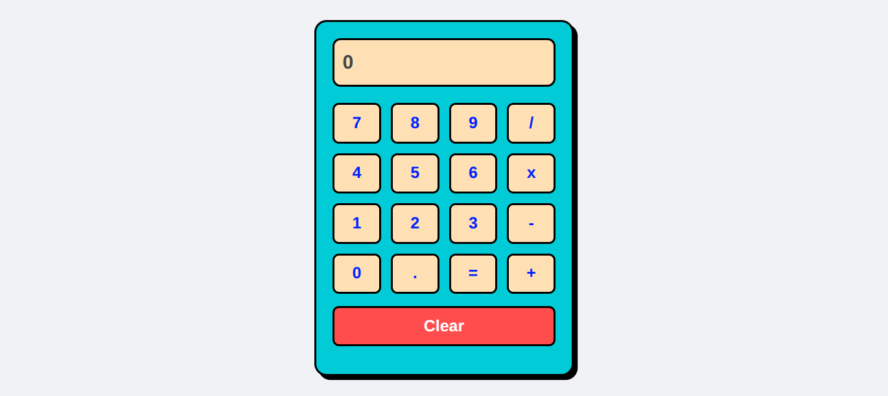
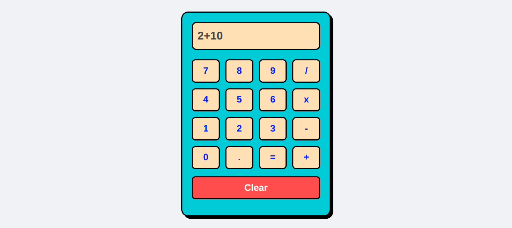
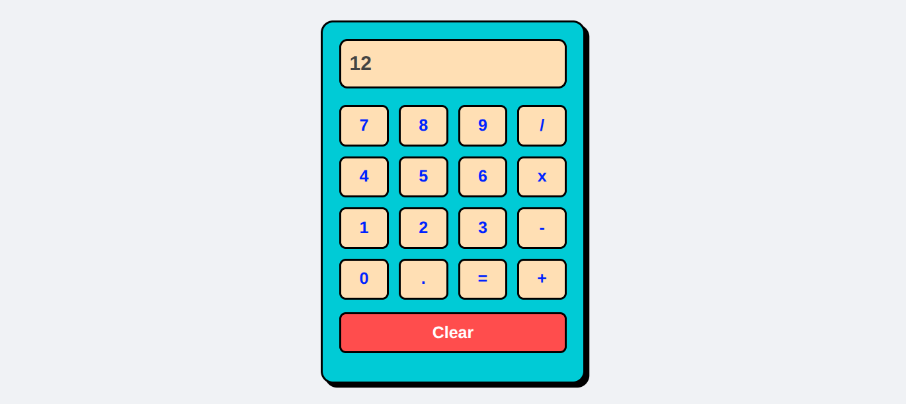

# JavaScript Simple Calculator

Một ứng dụng máy tính cầm tay được xây dựng hoàn toàn bằng HTML5, CSS3 và JavaScript thuần. Dự án tập trung vào việc thực hành kỹ thuật Binding dữ liệu và Event Handling trong JavaScript mà không cần sử dụng các thư viện bổ sung.

## Giao diện Dự án (Preview)

Dưới đây là hình ảnh kết quả giao diện thực tế của chiếc máy tính:

## Tính năng nổi bật
* **Bảo vệ lỗi cú pháp (Error Handling):** Sử dụng cấu trúc `try...catch` để bắt các lỗi nhập sai cú pháp toán học (ví dụ: `7++2` hoặc `5/*`) và hiển thị chữ `Error` 

