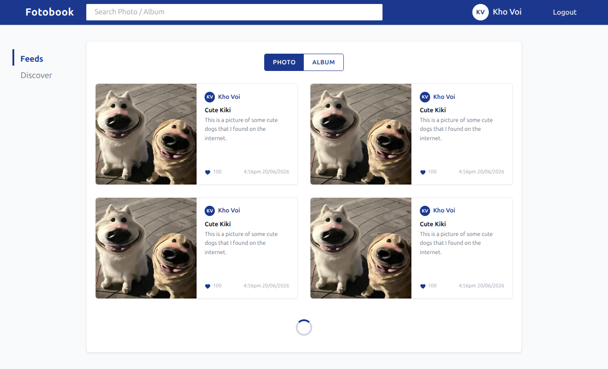
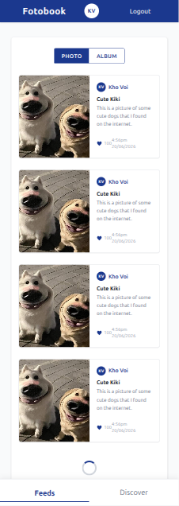

## Giao diện ứng dụng (Screenshots)

### 1. Desktop Layout
*Cấu trúc chia cột bằng CSS Grid, thanh Sidebar điều hướng nằm dọc bên trái, lưới bài viết chia 2 cột cân đối và nội dung căn giữa màn hình.*

### 2. Mobile Layout
*Thanh tìm kiếm tạm ẩn, cụm tài khoản thu gọn và thanh Sidebar tự động chuyển đổi thành Bottom Navigation Bar ghim ở đáy màn hình.*

